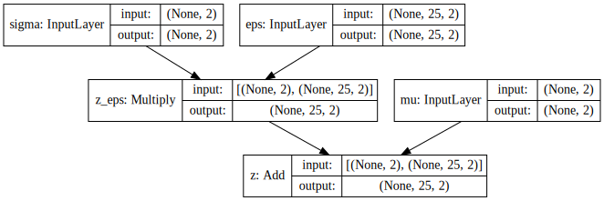
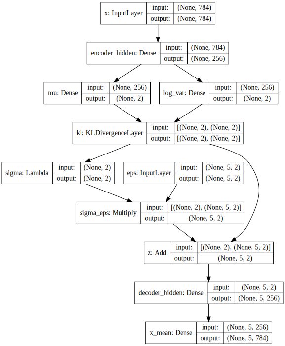

.. title: A simple way to do Bayesian Deep Learning in Keras
.. slug: a-simple-way-to-do-bayesian-deep-learning-in-keras
.. date: 2018-01-20 22:47:57 UTC+11:00
.. tags: bayesian, variational inference, keras, tensorflow, python, deep learning, representation learning, mathjax, draft
.. category: machine learning
.. link: 
.. description: 
.. type: text

Posterior distribution over weights
===================================

We approximate the full posterior distribution over the weights of the layer
using variational inference. We do this by specifying a *variational distribution*
which we use to approximate the exact posterior. The variational distribution of
choice here is a simple diagonal Gaussian. The parameters of the variational 
distribution are called *variational parameters* and consist of the mean and 
standard deviation of the layer's weights. They are the parameters of the Keras 
layer, which we add with ``self.add_weight`` (kind of a bad name). We don't take 
advantage of the option to add regularizer as we will add the KL directly to the 
loss ourselves later.

.. code:: python

   self.kernel_loc = self.add_weight(shape=(input_dim, self.units),
                                     name='kernel_loc')
   self.kernel_scale = self.add_weight(shape=(input_dim, self.units),
                                       name='kernel_scale')

   self.kernel = tf.distributions.Normal(loc=self.kernel_loc,
                                         scale=self.kernel_scale)

   if self.use_bias:
       self.bias_loc = self.add_weight(shape=(self.units,),
                                       name='bias_loc')
       self.bias_scale = self.add_weight(shape=(self.units,), 
                                         name='bias_scale')

       self.bias = tf.distributions.Normal(loc=self.bias_loc,
                                           scale=self.bias_scale)
   else:
       self.bias = None

.. _Writing your own Keras layers: https://keras.io/layers/writing-your-own-keras-layers/
.. _TensorFlow Distributions: https://www.tensorflow.org/api_docs/python/tf/distributions

Prior distribution
==================

.. code:: python

   if kernel_prior is None:
       kernel_prior = Normal(loc=0., scale=1.)   

   if bias_prior is None:
       bias_prior = Normal(loc=0., scale=1.)   

   self.kernel_prior = kernel_prior
   self.bias_prior = bias_prior

KL Divergence
=============

.. code:: python

   self.add_loss(kl_divergence(self.kernel_posterior,
                               self.kernel_prior))

   self.add_loss(kl_divergence(self.bias_posterior,
                               self.bias_prior))

In a :doc:`previous post 
<implementing-variational-autoencoders-in-keras-beyond-the-quickstart-tutorial>`, 
I demonstrated how to leverage Keras' modular design to implement variational
autoencoders in a way that makes it easy to tweak hyperparameters, adapt to it 
to other related models, and extend it to the more sophisticated methods 
proposed in the current research.

Recall that we optimize the generally intractable evidence lower bound (ELBO) 
using reparameterization gradients, which approximates the expectation of 
gradients with Monte Carlo (MC) samples. In their original paper, Kingma and 
Welling (2014) [#kingma2014]_ remark that an MC sample size of 1 is adequate for 
a sufficiently large batch size (~100). Obviously, this is highly dependent on 
the problem (more specifically the likelihood). In general, it is important to 
experiment with different MC sample sizes and observe the various effects it 
has on training stability. In this short post, we demonstrate how to tweak the 
MC sample size under our basic framework.

.. TEASER_END

Layer broadcasting
------------------

Thanks to broadcasting, the changes required are very minimal, but have vast
implications. The change we make is as simple as:

.. code:: python

   eps = Input(shape=(mc_samples, latent_dim))

That is, we make the shape of the noise from the base distribution 
``(batch_size, mc_samples, latent_dim)``. This is equivalent to drawing
``mc_samples`` of noise vectors *for each observation* in the batch, rather 
than just a single sample.

Everything else in our model specification can remain exactly the same, since
the ``Multiply`` layer will automatically broadcast: 

* ``eps`` of shape ``(batch_size, mc_samples, latent_dim)`` with 
* ``sigma`` of shape ``(batch_size, latent_dim)``

and thereby output tensor of shape ``(batch_size, mc_samples, latent_dim)``. 
Similarly the ``Add`` layer will automatically broadcast: 

* the previous output of shape ``(batch_size, mc_samples, latent_dim)`` with
* ``mu`` of shape ``(batch_size, latent_dim)``

to finally output latent variables ``z`` with 
shape ``(batch_size, mc_samples, latent_dim)``, corresponding to ``mc_samples`` 
of latent vectors with length ``latent_dim`` for every observation in the batch. 
This is illustrated in the figure below.

   Reparameterization with ``latent_dim=2, mc_samples=25``.

Exactly as before, we specify the output of the variational autoencoder as the 
output of the latent variable ``z`` fed through some generative model (a deep 
latent Gaussian model),

.. code:: python

   decoder = Sequential([
       Dense(intermediate_dim, input_dim=latent_dim, activation='relu'),
       Dense(original_dim, activation='sigmoid')
   ]) 

   x_mean = decoder(z) 

   vae = Model(inputs=[x, eps], outputs=x_mean)
   vae.compile(optimizer='rmsprop', loss=nll)

Note the specification of ``input_dim=latent_dim``. It tells this and all 
subsequent layers to operate only on this dimension. Hence, *for each observation*, 
we sample ``mc_samples`` latent variables, and propagate these through the 
generative model to obtain ``mc_samples`` predictions/observations. 
Please see the figure below.

   Reparameterization with ``latent_dim=2, mc_samples=25``. For each input 
   observation, we output ``mc_samples`` reconstructions.

In particular, notice that the input shape for each observation ``x`` in the 
batch is ``original_dim = 784`` (``28 * 28``), and that the output for each 
observation in the batch has shape ``(25, 784)``, corresponding to 
``mc_samples = 25`` samples from the predictive distribution. 
Lastly, observe that until the ``Multiply`` layer, all inputs and outputs were 
rank 2 tensors, consisting of a variable ``batch_size`` dimension, and a 
feature dimension.
The MC sample dimension is introduced by the ``eps`` noise input layer, which 
has shape ``(mc_samples, latent_dim) = (25, 2)``, and is propagated throughout
all subsequent layers.

Model fitting
-------------

At this stage, it is important to recognize the distinction between the 
**log likelihood of the mean output**, versus the 
**mean of the log likelihood over the outputs**. 
Since we are interested in estimating the expected log likelihood over the 
approximate posterior distribution, we require the latter.

Now, because the output of our model is now a rank 3 tensor, to use methods like 
``fit`` and ``evaluate``, we must ensure the targets are of a shape that can 
broadcast with the shape of our output, namely 
``(n_samples, mc_samples, original_dim)``. 
This is easily achieved by adding a dimension to the target array with

.. code:: python
   
   np.expand_dims(x_train, axis=1)

which has shape ``(n_samples, 1, original_dim)``. Now the loss function can 
broadcast this with the model output to yield ``(n_samples, mc_samples)`` loss
values. Methods like ``fit`` and ``evaluate`` will automatically aggregate this
into a single scalar loss value, e.g.

.. code:: pycon

   >>> vae.evaluate(x_test,
   ...              np.expand_dims(x_test, axis=1),
   ...              batch_size=batch_size)
   10000/10000 [==============================] - 0s 43us/step
   543.99742309570308   

Finally, fitting the model simply consists of:

.. code:: python

   vae.fit(
       x_train,
       np.expand_dims(x_train, axis=1),
       shuffle=True,
       epochs=epochs,
       batch_size=batch_size,
       validation_data=(
           x_test, 
           np.expand_dims(x_test, axis=1)
       )
   )

.. WARNING:: Keras 2.1.0 introduced breaking changes which tightens the 
   constraint on the targets and the predicted outputs to have *exactly* the
   same shape. This is not a showstopper, since we can just tile the array
   across the MC sample dimension/channel,

   .. code:: python

      np.tile(np.expand_dims(x_test, axis=1), 
              reps=(1, mc_samples, 1))

   or equivalently,

   .. code:: python

      np.rollaxis(np.tile(x_test, reps=(mc_samples, 1, 1)), axis=1)

   This is neither as slick nor as space efficient, but it gets the job done.

Distribution over Reconstructions
---------------------------------

Let's choose an arbitrary observation from the test set and feed it through
our autoencoder model ``vae``. This yields ``mc_samples=25`` samples from the
predictive distribution over reconstructions.

.. code:: pycon

   >>> x = x_test[0] # choose arbitrary observation 
   >>> recons = np.squeeze(vae.predict(np.atleast_2d(x)))
   >>> recons.shape
   (25, 784)

We can visualize these:

.. code:: python

   plt.figure(figsize=(6, 4))
   plt.imshow(x.reshape(28, 28), cmap='gray') 
   plt.imshow(np.block(list(map(list, recons.reshape(5, 5, 28, 28)))),
              cmap='gray') 
   plt.show()

The output of this is shown in the figure below. You may need to squint closely
to see that the sampled reconstructions are different to each other.

.. figure:: ../../images/vae/mc_samples_reconstructions.png
   :width: 600px
   :align: center

   5x5 grid reconstructions for a given observation.

As a sanity check,

.. code:: pycon

   >>> np.all(recons[0] == recons[-1])
   False
   >>> np.all(recons[1:] == recons[:-1], axis=1)
   array([False, False, False, False, False, False, False, False, False, False,
          False, False, False, False, False, False, False, False, False, False,
          False, False, False, False], dtype=bool)

Summary
-------

In this post, we demonstrated how simple it is to extend our basic framework 
to allow for specification of arbitrary Monte Carlo samples sizes. 
We simply leveraged Keras' ability to broadcast inputs with its layers and let 
it propagate the additional MC sample channel/dimension to the final output. 
Next, we applied a simple trick so that the target array broadcasts with the 
final output, which allows us to approximate the expected log likelihood using 
the Monte Carlo samples. 
Finally, we demonstrated how we can use our fitted model to obtain a 
distribution over reconstructions. This approach is appealing not only for 
its simplicity, but its applicability to large class of problems with 
various likelihoods.

In a future post, we will use methods discussed here to implement and
explore *Importance Weighted Autoencoders* [#burda2015]_, which uses 
*importance sampling* to approximate the ELBO.

References
----------

.. [#kingma2014] D. P. Kingma and M. Welling, 
   "Auto-Encoding Variational Bayes," 
   in Proceedings of the 2nd International Conference on Learning 
   Representations (ICLR), 2014.

.. [#burda2015] Y. Burda, R. Grosse, and R. Salakhutdinov, 
   "Importance Weighted Autoencoders,"
   in Proceedings of the 3rd International Conference on Learning 
   Representations (ICLR), 2015.

Appendix
--------

Below you can find:

* The `accompanying Jupyter Notebook`_ used to generate the diagrams and plots 
  in this post.
* The above snippets combined in a `single executable Python file`_.

.. _accompanying Jupyter Notebook: /listings/vae/variational_autoencoder_mc_samples.ipynb.html
.. _single executable Python file: /listings/vae/variational_autoencoder_mc_samples.py.html
