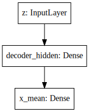
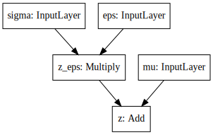
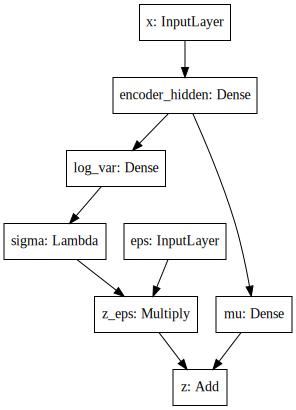
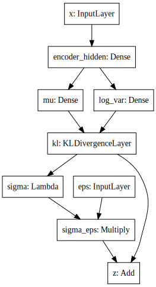
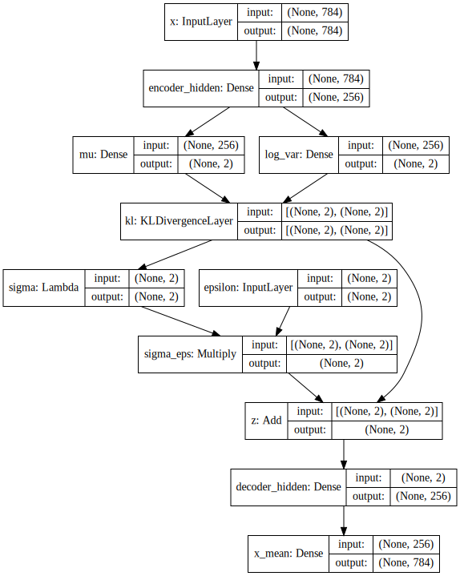
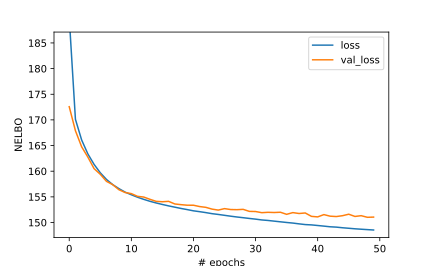
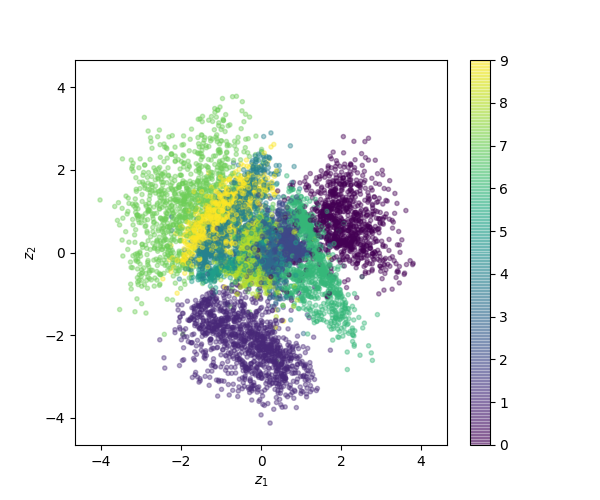
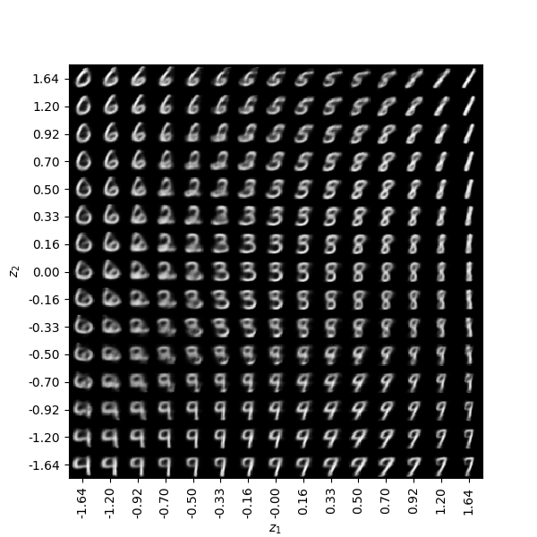

.. title: Implementing Variational Autoencoders in Keras: Beyond the Quickstart Tutorial
.. slug: implementing-variational-autoencoders-in-keras-beyond-the-quickstart-tutorial
.. date: 2017-10-23 01:19:59 UTC+11:00
.. tags: variational inference, keras, tensorflow, python, variational autoencoder, unsupervised learning, deep learning, representation learning, mathjax
.. category: coding
.. link: 
.. description: 
.. type: text

.. admonition:: Draft

   Please do not share or link.

Keras_ is awesome. It is a very well-designed library that clearly abides by 
its `guiding principles`_ of modularity and extensibility, and allows us to 
easily assemble powerful, complex models from primitive building blocks. 
This has been demonstrated in numerous blog posts and tutorials, in particular,
the excellent tutorial on `Building Autoencoders in Keras`_. 
As the name suggests, that tutorial provides examples of how to implement 
various kinds of autoencoders in Keras, including the variational autoencoder 
(VAE) [#kingma2014]_. 

.. figure:: ../../images/vae/result_combined.png
   :scale: 200 %
   :align: center

   Visualization of 2D manifold of MNIST digits (left)
   and the representation of digits in latent space colored according to their 
   digit labels (right).

Like all autoencoders, the variational autoencoder is primarily used for 
unsupervised learning of hidden representations. 
However, they are fundamentally different to your usual neural network-based 
autoencoder in that they approach the problem from a probabilistic perspective. 
They specify a joint distribution over the observed and latent variables, and 
approximate the intractable posterior conditional density over latent 
variables with variational inference, using an *inference network* 
[#inference1]_ [#inference2]_ (or more classically, a *recognition model* 
[#dayan1995]_) to amortize the cost of inference.

.. TEASER_END

While the examples in the aforementioned tutorial do well to showcase the 
versatility of Keras on a wide range of autoencoder model architectures, 
`its implementation of the variational autoencoder`_ doesn't properly take 
advantage of Keras' modular design, making it difficult to generalize and 
extend in important ways. As we will see, it relies on implementing custom 
layers and constructs that are restricted to a specific instance of 
variational autoencoders. This is a shame because when combined, Keras' 
building blocks are powerful enough to encapsulate most variants of the 
variational autoencoder and more generally, recognition-generative model 
combinations for which the generative model belongs to a large family of 
*deep latent Gaussian models* (DLGMs) [#rezende2014]_.

The goal of this post is to propose a clean and elegant alternative 
implementation that takes better advantage of Keras' modular design. 
It is not intended as tutorial on variational autoencoders [*]_. 
Rather, we study variational autoencoders as a specific case of variational 
inference in deep latent Gaussian models with inference networks, and 
demonstrate how we can use Keras to implement them in a modular fashion such 
that they can be easily adapted to approximate inference in various common 
problems with different (non-Gaussian) likelihoods, such as classification with 
Bayesian logistic / softmax regression. 

This first post will lay the groundwork for a series of future posts that 
explore ways to extend this basic modular framework to implement the more
powerful methods proposed in the latest research, such as the normalizing flows 
for building richer posterior approximations [#rezende2015]_, importance weighted
autoencoders [#burda2015]_, the Gumbel-softmax trick for inference in discrete 
latent variables [#jang2016]_, and even the most recent GAN-based density-ratio 
estimation techniques for likelihood-free inference [#mescheder2017]_ [#tran2017]_.

.. _Keras: https://keras.io/
.. _guiding principles: https://keras.io/#guiding-principles
.. _Building Autoencoders in Keras: https://blog.keras.io/building-autoencoders-in-keras.html
.. _is not a way to train generative models: http://dustintran.com/blog/variational-auto-encoders-do-not-train-complex-generative-models
.. _its implementation of the variational autoencoder: https://github.com/fchollet/keras/blob/2.0.8/examples/variational_autoencoder.py

Model specification
===================

First, it is important to understand that the variational autoencoder 
`is not a way to train generative models`_. 
Rather, the generative model is a component of the variational autoencoder and
is, in general, a deep latent Gaussian model.
In particular, let :math:`\mathbf{x}` be a local observed variable and 
:math:`\mathbf{z}` its corresponding local latent variable, with joint 
distribution 

.. math:: 
   
   p_{\theta}(\mathbf{x}, \mathbf{z}) 
   = p_{\theta}(\mathbf{x} | \mathbf{z}) p(\mathbf{z}).

In Bayesian modelling, we assume the distribution of observed variables to be 
governed by the latent variables. Latent variables are drawn from a prior 
density :math:`p(\mathbf{z})` and related to the observations though the 
likelihood :math:`p_{\theta}(\mathbf{x} | \mathbf{z})`.
Deep latent Gaussian models (DLGMs) are a general class of models where the 
observed variable is governed by a *hierarchy* of latent variables, and the
latent variables at each level of the hierarchy are Gaussian *a priori* 
[#rezende2014]_.

In a typical instance of the variational autoencoder, we have only a single 
layer of latent variables with a Normal prior distribution,

.. math:: p(\mathbf{z}) = \mathcal{N}(\mathbf{0}, \mathbf{I}).

Now, each local latent variable is related to its corresponding observation 
through the likelihood :math:`p_{\theta}(\mathbf{x} | \mathbf{z})`, which can 
be viewed as a *probabilistic* decoder. Given a hidden lower-dimensional 
representation (or "code") :math:`\mathbf{z}`, it "decodes" it into a 
*distribution* over the observation :math:`\mathbf{x}`.

Decoder
-------

In this example, we define :math:`p_{\theta}(\mathbf{x} | \mathbf{z})` to 
be a multivariate Bernoulli whose probabilities are computed from 
:math:`\mathbf{z}` using a fully-connected neural network with a single hidden 
layer,

.. math:: 

   p_{\theta}(\mathbf{x} | \mathbf{z})
     & = \mathrm{Bern}( \sigma( \mathbf{W}_2 \mathbf{h} + \mathbf{b}_2 ) ), \\
   \mathbf{h} & = h(\mathbf{W}_1 \mathbf{z} + \mathbf{b}_1),

where :math:`\sigma` is the logistic sigmoid function, :math:`h` is some 
non-linearity, and the model parameters 
:math:`\theta = \{ \mathbf{W}_1, \mathbf{W}_2, \mathbf{b}_1, \mathbf{b}_1 \}` 
consist of the weights and biases of this neural network. 

It is straightforward to implement this in Keras with the 
`Sequential model API <https://keras.io/models/sequential/>`_:

.. code:: python

   decoder = Sequential([
     Dense(intermediate_dim, input_dim=latent_dim, activation='relu'),
     Dense(original_dim, activation='sigmoid')
   ])

You can view a summary of the model parameters :math:`\theta` by calling 
``decoder.summary()``. Additionally, you can produce a high-level diagram of 
the network architecture, and optionally the input and output shapes of each 
layer using `plot_model <https://keras.io/visualization/>`_ from the 
``keras.utils.vis_utils`` module. Although our architecture is about as 
simple as it gets, it is included in the figure below as an example of what
the diagrams look like.

   Decoder architecture.

Note that by fixing :math:`\mathbf{W}_1`, :math:`\mathbf{b}_1` and :math:`h` 
to be the identity matrix, the zero vector, and the identity function, 
respectively (or equivalently dropping the first ``Dense`` layer in the snippet 
above altogether), we recover *logistic factor analysis*.
With similarly minor modifications, we can recover other members from the 
family of DLGMs, which include *non-linear factor analysis*, 
*non-linear Gaussian belief networks*, *sigmoid belief networks*, and many 
others [#rezende2014]_.

.. code:: python

   def nll(y_true, y_pred):
       """ Negative log likelihood (Bernoulli). """

       # keras.losses.binary_crossentropy give the mean
       # over the last axis. we require the sum
       return K.sum(K.binary_crossentropy(y_true, y_pred), axis=-1)

.. Tip:: If you are using the TensorFlow backend, you can directly use the 
   (negative) log probability of ``Bernoulli`` from TensorFlow Distributions as 
   a Keras loss, as I demonstrate in my post on 
   :doc:`using-negative-log-likelihoods-of-tensorflow-distributions-as-keras-losses`.

   That is, the following is equivalent to the above definition which instead 
   uses the ``K.binary_crossentropy`` function:

   .. code:: python   

      def nll(y_true, y_pred):
          """ Negative log likelihood (Bernoulli). """

          lh = K.tf.distributions.Bernoulli(probs=y_pred)   

          return - K.sum(lh.log_prob(y_true), axis=-1)

Inference
=========

Having specified the generative process, we would now like to perform inference
on the latent variables and model parameters :math:`\mathbf{z}` and 
:math:`\theta`, respectively.
In particular, our goal is to compute the posterior 
:math:`p_{\theta}(\mathbf{z} | \mathbf{x})`, the conditional density of the
latent variable :math:`\mathbf{z}` given observed variable :math:`\mathbf{x}`.
Additionally, we wish to optimize the model parameters :math:`\theta` with 
respect to the marginal likelihood :math:`p_{\theta}(\mathbf{x})`. 
Both depend on the marginal likelihood, whose calculation requires marginalizing 
out the latent variables :math:`\mathbf{z}`. In general, this is computational 
intractable, requiring exponential time to compute. Or, it is analytically 
intractable and cannot be evaluated in closed-form, as it is in our case 
where the Gaussian prior is non-conjugate to the Bernoulli likelihood.

To circumvent this intractability we turn to variational inference, which 
formulates inference as an optimization problem. It seeks an approximate
posterior :math:`q_{\phi}(\mathbf{z} | \mathbf{x})` with *variational parameters* 
:math:`\phi` closest in Kullback-Leibler (KL) divergence to the true posterior. 

.. math::

   \phi^* = \mathrm{argmin}_{\phi} 
   \mathrm{KL} [q_{\phi}(\mathbf{z} | \mathbf{x}) \| p_{\theta}(\mathbf{z} | \mathbf{x}) ]

With the luck we've had so far, it shouldn't come as a surprise anymore that 
*this too* is intractable. It also depends on the log marginal likelihood,
whose intractability is the reason we appealed to approximate inference in the 
first place. Instead, we *maximize* an alternative objective function, the 
*evidence lower bound* (ELBO), which is expressed as

.. math::

   \mathrm{ELBO}(q) 
   &= 
   \mathbb{E}_{q_{\phi}(\mathbf{z} | \mathbf{x})} [
     \log p_{\theta}(\mathbf{x} | \mathbf{z}) + 
     \log p(\mathbf{z}) -
     \log q_{\phi}(\mathbf{z} | \mathbf{x})
   ] \\
   &= 
   \mathbb{E}_{q_{\phi}(\mathbf{z} | \mathbf{x})} [
     \log p_{\theta}(\mathbf{x} | \mathbf{z})
   ] - \mathrm{KL} [q_{\phi}(\mathbf{z} | \mathbf{x}) \| p(\mathbf{z}) ].

Importantly, the ELBO is a lower bound to the log marginal likelihood. 
Therefore, maximizing it with respect to the model parameters :math:`\theta` 
approximately maximizes the log marginal likelihood. 
Additionally, maximizing it with respect variational parameter :math:`\phi` can 
be shown to minimize
:math:`\mathrm{KL} [q_{\phi}(\mathbf{z} | \mathbf{x}) \| p_{\theta}(\mathbf{z} | \mathbf{x}) ]`. Also, it turns out that the KL divergence determines the 
tightness of the lower bound, where we have equality iff the KL divergence is 
zero, which happens iff 
:math:`q_{\phi}(\mathbf{z} | \mathbf{x}) = p_{\theta}(\mathbf{z} | \mathbf{x})`.
Hence, simultaneously maximizing it with respect to :math:`\theta` and 
:math:`\phi` gets us two birds with one stone.

Next we discuss the form of the approximate posterior 
:math:`q_{\phi}(\mathbf{z} | \mathbf{x})`, which can be viewed as a 
*probabilistic* encoder. Its role is opposite to that of the decoder. 
Given an observation :math:`\mathbf{x}`, it "encodes" it into a *distribution* 
over its hidden lower-dimensional representations.

Encoder
-------

For each local observed variable :math:`\mathbf{x}_n`, we wish to approximate 
the true posterior distribution :math:`p(\mathbf{z}_n|\mathbf{x}_n)` over its 
corresponding local latent variables :math:`\mathbf{z}_n`. A common approach it 
to approximate it using a variational distribution 
:math:`q_{\phi_n}(\mathbf{z}_n | \mathbf{x}_n)` that is a diagonal Gaussian, 
where the *local* variational parameters 
:math:`\phi_n = \{ \mathbf{\mu}_n, \mathbf{\sigma}_n \}` are the means and 
variances of this approximating distribution,

.. math::

   q_{\phi_n}(\mathbf{z}_n | \mathbf{x}_n) = 
   \mathcal{N}(
     \mathbf{z}_n | 
     \mathbf{\mu}_n, 
     \mathrm{diag}(\mathbf{\sigma}_n^2)
   ).

This approach has a number of shortcomings. First, the number of local 
variational parameters we are required to optimize grows with the size of the
dataset. Second, a new set of local variational parameters need to be optimized
for new unseen test points. This is not to mention the strong factorization 
assumption we make by specifying diagonal Gaussian distributions as the family 
of approximations.

We *amortize* the cost of inference by introducing an *inference network* which
approximates the local variational parameters :math:`\phi_n` for a given local
observed variable :math:`\textbf{x}_n`. 
For our approximating distribution in particular, given :math:`\textbf{x}_n` the 
inference network yields two outputs :math:`\mu_{\phi}(\textbf{x}_n)` and 
:math:`\sigma_{\phi}(\textbf{x}_n)`, which we use to approximate its local 
variational parameters :math:`\mathbf{\mu}_n` and :math:`\mathbf{\sigma}_n`, 
respectively. 
Our approximate posterior distribution now becomes

.. math::

   q_{\phi}(\mathbf{z} | \mathbf{x}) 
   = 
   \mathcal{N}(
     \mathbf{z} | 
     \mathbf{\mu}_{\phi}(\mathbf{x}), 
     \mathrm{diag}(\mathbf{\sigma}_{\phi}^2(\mathbf{x}))
   ).

Instead of learning local variational parameters :math:`\phi_n` for each 
data-point, we now learn a fixed number of *global* variational parameters 
:math:`\phi` which constitute the parameters of the inference network. 
Moreover, this approximation allows statistical strength to be shared across 
observed data-points and also generalize to unseen test points.
Inference networks are more classically known as *recognition models*, and are
used in the closely-related Helmholtz machines [#dayan1995]_.

We specify the location and scale of this distribution as the output of an 
inference network. For this post, we keep the architecture of the network 
simple, with only a single hidden layer and two fully-connected output layers. 
Again, this is simple to define in Keras:

.. code:: python

   # input layer
   x = Input(shape=(original_dim,))

   # hidden layer
   h = Dense(intermediate_dim, activation='relu')(x)  

   # output layer for mu
   z_mu = Dense(latent_dim)(h)

   # output layer for sigma
   z_log_var = Dense(latent_dim)(h)
   z_sigma = Lambda(lambda t: K.exp(.5*t))(z_log_var)

Since this network has multiple outputs, we couldn't use the Sequential model 
API as we did for the decoder. Instead, we must resort to the more powerful 
`Functional API <https://keras.io/getting-started/functional-api-guide/>`_, 
which allows you to implement complex models with shared layers, multiple 
inputs, multiple outputs, and so on.

.. TODO
.. **Figure here**
.. DONE cannot use Sequential model API 
.. Lambda layer
.. Reference to Helmholtz machines, which has a recognition model and inference
.. is done using the wake-sleep algorithm.

.. Note that it is not dependent on the observed data x_i 
.. and does not appear in the expression q_i(z_i). It is only related to x_i 
.. through the ELBO. 

KL Divergence
#############

latent space regularization

.. math:: 

   \mathrm{KL} [q_{\phi}(\mathbf{z} | \mathbf{x}) \| p(\mathbf{z}) ]
   = - \frac{1}{2} \sum_{k=1}^K \{ 1 + \log \sigma_k^2 - \mu_k^2 - \sigma_k^2 \}

.. code:: python

   class KLDivergenceLayer(Layer):  

       """ Identity transform layer that adds KL divergence
       to the final model loss.
       """  

       def __init__(self, *args, **kwargs):
           self.is_placeholder = True
           super(KLDivergenceLayer, self).__init__(*args, **kwargs)   

       def call(self, inputs):  

           mu, log_var = inputs   

           kl_batch = - .5 * K.sum(1 + log_var -
                                   K.square(mu) -
                                   K.exp(log_var), axis=-1)   

           self.add_loss(K.mean(kl_batch), inputs=inputs)   

           return inputs

.. code:: python

   z_mu, z_log_var = KLDivergenceLayer()([z_mu, z_log_var])

by itself, it will learn to ignore the input and map all outputs to 0.
It is only when we tack on the decoder that the reconstruction likelihood
is introduced. Only then will we reconcile the likelihood / observed data with 
our prior to form the posterior over latent codes.

At this stage we could specify 
``prob_encoder = Model(inputs=x, outputs=[z_mu, z_sigma])``
and compile it with something like 
``prob_encoder.compile(optimizer='rmsprop`, loss=None)``. 
When we fit it, it would trivially map all inputs to 0 and 1, thus learning the
prior distribution.

inputs mu and log_var are of shape (batch_size, latent_dim)
the loss we add should be scalar. this is unlike loss 
function specified in model compile which should returns 
loss vector of shape (batch_size,) since it requires 
loss for each datapoint in the batch for sample 
weighting.

Reparameterization using Merge Layers
#####################################

To perform gradient-based optimization of ELBO, we require its gradients with 
respect to the variational parameters :math:`\phi`, which is generally 
intractable. Currently, the dominant approach for circumventing this is by
Monte Carlo (MC) estimation of the gradients. There are a several estimators
based on different variance reduction techniques. However, for continuous 
latent variables, the *reparameterization gradients* can be shown to have the 
lowest variance among competing estimators.

The ELBO can be written as an expectation of a multivariate function 
:math:`f(\mathbf{x}, \mathbf{z}) = \log p_{\theta}(\mathbf{x} , \mathbf{z}) - \log q_{\phi}(\mathbf{z} | \mathbf{x})`
over distribution :math:`q_{\phi}(\mathbf{z} | \mathbf{x})`.

.. math::

   \nabla_{\phi} 
   \mathbb{E}_{q_{\phi}(\mathbf{z} | \mathbf{x})} [ f(\mathbf{x}, \mathbf{z}) ]
   &= \nabla_{\phi} \mathbb{E}_{p(\mathbf{\epsilon})} [ 
      f(\mathbf{x}, 
        g_{\phi}(\mathbf{x}, \mathbf{\epsilon})) 
   ] \\
   &= \mathbb{E}_{p(\mathbf{\epsilon})} [ 
    \nabla_{\phi}
    f(\mathbf{x}, 
      g_{\phi}(\mathbf{x}, \mathbf{\epsilon})) 
   ] \\

Specifying  gives us the gradient of the ELBO above.

.. math::

   z = g_{\phi}(\mathbf{x}, \mathbf{\epsilon}), \quad 
     \mathbf{\epsilon} \sim p(\mathbf{\epsilon})

.. math::

   g_{\phi}(\mathbf{x}, \mathbf{\epsilon}) = 
     \mathbf{\mu}_{\phi}(\mathbf{x}) + 
     \mathbf{\sigma}_{\phi}(\mathbf{x}) \odot 
     \mathbf{\epsilon}, \quad 
     \mathbf{\epsilon} \sim 
     \mathcal{N}(\mathbf{0}, \mathbf{I})
   
Assume ``z_mu`` and ``z_sigma`` are the outputs of some layers. Then, using  
`Merge Layers <https://keras.io/layers/merge/>`_, ``Add`` and ``Multiply``:

.. code:: python

   eps = Input(shape=(latent_dim,))
   z_eps = Multiply()([z_sigma, eps])   

   z = Add()([z_mu, z_eps])

   Reparameterization with simple location-scale transformation using Keras 
   merge layers.

Lambda layer, which simultaneously draws samples from a hard-coded base 
distribution and performs reparameterization. This implementation achieves a 
more appropriate level of modularity and abstraction. It's makes it clear that
each of these atomic building blocks are themselves deterministic 
transformations which together make up a deterministic transformation. 
The source of stochasticity comes from the input, which we are able to tweak at
test time. Gumbel-softmax trick.

.. code:: python

   eps = Input(tensor=K.random_normal(shape=(K.shape(x)[0], latent_dim)))

For the sake of illustration, we've fixed ``sigma`` and ``mu`` as ``Input`` 
layers. That's why it says ``InputLayer`` next to it. In reality, it will be 
the output layer of a network. We specify :math:`\mathbf{\mu}_{\phi}(\mathbf{x})` 
and :math:`\mathbf{\sigma}_{\phi}(\mathbf{x})` now.

   Encoder architecture.

   Full encoder architecture, including auxiliary KL divergence layer.

Putting it all together
-----------------------

.. code:: python

   x = Input(shape=(original_dim,))
   h = Dense(intermediate_dim, activation='relu')(x) 

   z_mu = Dense(latent_dim)(h)
   z_log_var = Dense(latent_dim)(h) 

   z_mu, z_log_var = KLDivergenceLayer()([z_mu, z_log_var])
   z_sigma = Lambda(lambda t: K.exp(.5*t))(z_log_var) 

   eps = Input(tensor=K.random_normal(shape=(K.shape(x)[0], latent_dim)))
   z_eps = Multiply()([z_sigma, eps])
   z = Add()([z_mu, z_eps]) 

   decoder = Sequential([
       Dense(intermediate_dim, input_dim=latent_dim, activation='relu'),
       Dense(original_dim, activation='sigmoid')
   ]) 

   x_mean = decoder(z)

.. code:: python

   vae = Model(inputs=[x, eps], outputs=x_mean)
   vae.compile(optimizer='rmsprop', loss=nll)

   Variational autoencoder architecture.

When combined end-to-end, the inference network and the deep latent Gaussian
model can be seen as having an autoencoder structure. 
Indeed, this general structure contains the variational autoencoder as a special 
case, and more traditionally, the Helmholtz machine. 
Even more generally, we can use this structure to perform amortized variational 
inference in complex generative models for a wide array of supervised, 
unsupervised and semi-supervised tasks.

The point of this tutorial is to illustrate the general framework for performing
amortized variational inference using Keras, treating the inference network 
(approximate posterior) and the generative network (likelihood) as black-boxes.
What we've used for the encoder and decoder each with a single hidden 
full-connected layer is perhaps the minimal viable architecture. 
In the examples directory, Keras provides a more sophisticated variational 
autoencoder with deconvolutional layers. The architecture definitions can be
trivially copy-pasted here without need to modify anything else.

Parameter Learning
==================

We load the training data as usual. Now the ``vae`` is explicitly specified with
random noise source as an auxiliary input. This allows to easily control the 
base distribution :math:`p(\mathbf{\epsilon})` and also how we draw Monte Carlo
samples of :math:`\mathbf{z}` for each datapoint :math:`\mathbf{x}`. Usually
we just stick with a simple isotropic Gaussian distribution and draw a different
MC sample for each datapoint.

.. code:: python

   (x_train, y_train), (x_test, y_test) = mnist.load_data()
   x_train = x_train.reshape(-1, original_dim) / 255.
   x_test = x_test.reshape(-1, original_dim) / 255.   

Model fitting feels less intuitive. The ``vae`` is compiled with ``loss=None``
explicitly specified which raises a warning. When fit is called, the targets 
argument is left unspecified, and the reconstruction loss is optimized through
the `CustomLayer`. This mapping from mathematical problem formulation to code
implementation appears more natural and straightforward. It's easy to understand
at a glance from our call to the ``fit`` method that we're training a
probabilistic auto-encoder.

.. code:: python

   vae.fit(x_train,
           x_train,
           shuffle=True,
           epochs=epochs,
           batch_size=batch_size,
           validation_data=(x_test, x_test))

Personally, I prefer this view since the all sources of stochasticity emanate
from the inputs to the model. 

Loss (NELBO) Convergence
------------------------

.. code:: python

   fig, ax = plt.subplots() 

   pd.DataFrame(hist.history).plot(ax=ax) 

   ax.set_ylabel('NELBO')
   ax.set_xlabel('# epochs') 

   plt.show()

Model evaluation
================

.. code:: python

   encoder = Model(x, z_mu) 

   # display a 2D plot of the digit classes in the latent space
   z_test = encoder.predict(x_test, batch_size=batch_size)
   plt.figure(figsize=(6, 6))
   plt.scatter(z_test[:, 0], z_test[:, 1], c=y_test,
               alpha=.4, s=3**2, cmap='viridis')
   plt.colorbar()
   plt.show()

.. code:: python

   # display a 2D manifold of the digits
   n = 15  # figure with 15x15 digits
   digit_size = 28 

   # linearly spaced coordinates on the unit square were transformed
   # through the inverse CDF (ppf) of the Gaussian to produce values
   # of the latent variables z, since the prior of the latent space
   # is Gaussian
   u_grid = np.dstack(np.meshgrid(np.linspace(0.05, 0.95, n),
                                  np.linspace(0.05, 0.95, n)))
   z_grid = norm.ppf(u_grid)
   x_decoded = decoder.predict(z_grid.reshape(n*n, 2))
   x_decoded = x_decoded.reshape(n, n, digit_size, digit_size) 

   plt.figure(figsize=(10, 10))
   plt.imshow(np.block(list(map(list, x_decoded))), cmap='gray')
   plt.show()

Recap
=====

- Demonstration of Sequential and functional Model API
- Custom auxiliary layers that augments the model loss
- Fixing input to source of stochasticity
- Reparameterization using Merge layers

What's next
===========

Normalizing flows

We illustrate how to employ the simple Gumbel-Softmax reparameterization to 
build a Categorical VAE with discrete latent variables.

We can easily extend ``KLDivergenceLayer`` to use an auxiliary density ratio 
estimator function, instead of evaluating the KL divergence in the closed-form
expression above. 
This relaxes the requirement on approximate posterior 
:math:`q(\mathbf{z}|\mathbf{x})` (and incidentally, also prior 
:math:`p(\mathbf{z})`) to yield tractable densities, at the cost of maximizing 
a cruder estimate of the ELBO. 
This is known as Adversarial Variational Bayes [#mescheder2017]_, and is an 
important line of recent research that extends the applicability of variational 
inference to arbitrarily expressive implicit probabilistic models [#tran2017]_.

Footnotes
=========

.. [*] For a complete treatment of variational autoencoders, and variational 
   inference in general, I highly recommend:

   * Jaan Altosaar's blog post, `What is a variational autoencoder? 
     <https://jaan.io/what-is-variational-autoencoder-vae-tutorial/>`_.
   * Diederik P. Kingma's PhD Thesis, 
     `Variational Inference and Deep Learning: A New Synthesis 
     <https://www.dropbox.com/s/v6ua3d9yt44vgb3/cover_and_thesis.pdf?dl=1>`_.

References
==========

.. [#kingma2014] D. P. Kingma and M. Welling, 
   "Auto-Encoding Variational Bayes," 
   in Proceedings of the 2nd International Conference on Learning 
   Representations (ICLR), 2014.
.. [#inference1] `Edward tutorial on Inference Networks 
   <http://edwardlib.org/tutorials/inference-networks>`_ 
.. [#inference2] Section "Recognition models and amortised inference" in 
   `Shakir's blog post 
   <http://blog.shakirm.com/2015/01/variational-inference-tricks-of-the-trade/>`_.
.. [#dayan1995] Dayan, P., Hinton, G. E., Neal, R. M., & Zemel, R. S. (1995). 
   The Helmholtz machine. Neural Computation, 7(5), 889–904. 
   http://doi.org/10.1162/neco.1995.7.5.889
.. [#rezende2014] Rezende, D. J., Mohamed, S., & Wierstra, D. (2014). 
   "Stochastic backpropagation and approximate inference in deep generative models,"
   in Proceedings of The 31st International Conference on Machine Learning, 2014,
   (Vol. 32, pp. 1278–1286). Bejing, China: PMLR. http://doi.org/10.1051/0004-6361/201527329
.. [#rezende2015] D. Rezende and S. Mohamed, 
   "Variational Inference with Normalizing Flows," 
   in Proceedings of the 32nd International Conference on Machine Learning, 2015, 
   vol. 37, pp. 1530–1538.
.. [#burda2015] Y. Burda, R. Grosse, and R. Salakhutdinov, 
   "Importance Weighted Autoencoders,"
   in Proceedings of the 3rd International Conference on Learning 
   Representations (ICLR), 2015.
.. [#jang2016] E. Jang, S. Gu, and B. Poole, 
   "Categorical Reparameterization with Gumbel-Softmax," Nov. 2016.
   in Proceedings of the 5th International Conference on Learning 
   Representations (ICLR), 2017.
.. [#mescheder2017] L. Mescheder, S. Nowozin, and A. Geiger, 
   "Adversarial Variational Bayes: Unifying Variational Autoencoders and 
   Generative Adversarial Networks," 
   in Proceedings of the 34th International Conference on Machine Learning, 2017, 
   vol. 70, pp. 2391–2400.
.. [#tran2017] D. Tran, R. Ranganath, and D. Blei, 
   "Hierarchical Implicit Models and Likelihood-Free Variational Inference," 
   *to appear in* Advances in Neural Information Processing Systems 31, 2017.

Appendix
========

Below, you can find:

* The `accompanying Jupyter Notebook`_ used to generate the diagrams and plots 
  in this post.
* The above snippets combined in a single executable Python file:

.. listing:: vae/variational_autoencoder_improved.py python

.. _accompanying Jupyter Notebook: /listings/vae/variational_autoencoder.ipynb.html
