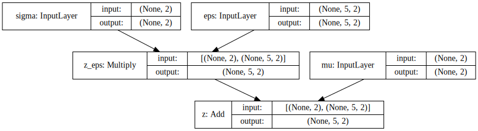

.. title: Implementing Variational Autoencoders in Keras: Beyond the Quickstart Tutorial
.. slug: implementing-variational-autoencoders-in-keras-beyond-the-quickstart-tutorial
.. date: 2017-10-23 01:19:59 UTC+11:00
.. tags: variational inference, keras, tensorflow, python, variational autoencoder, unsupervised learning, mathjax
.. category: coding
.. link: 
.. description: 
.. type: text

excellent tutorial on `Building Autoencoders in Keras`_ 

it illustrates the power and simplicity 

A number of important shortcomings:

- Number of Monte Carlo samples; explicitly as model input
- Custom layer vs natural use of primitive / building-blocks
- Extensible KL Divergence layer (Adversarial Variational Bayes)
- Easy to extend to Normalizing Flows
- Natural model of loss / likelihood, easily extends to regression, classification, etc.

.. listing:: variational_autoencoder.py python

- https://github.com/fchollet/keras/blob/2.0.8/examples/variational_autoencoder.py

.. _Building Autoencoders in Keras: https://blog.keras.io/building-autoencoders-in-keras.html

.. math::

   q_{\phi}(\mathbf{z} | \mathbf{x}) 
   = 
   \mathcal{N}(
     \mathbf{z} | 
     \mathbf{\mu}_{\phi}(\mathbf{x}), 
     \mathrm{diag}(\mathbf{\sigma}_{\phi}^2(\mathbf{x}))
   )

Reparameterization with Keras Layers
------------------------------------

Assume ``z_mu`` and ``z_sigma`` are the outputs of some layers. Then, using the 
`Keras Merge Layers <https://keras.io/layers/merge/>`_ ``Add`` and ``Multiply``:

.. code:: python

   eps = Input(shape=(mc_samples, latent_dim), name='eps')

   z_eps = Multiply(name='z_eps')([z_sigma, eps])
   z = Add(name='z')([z_mu, z_eps])

.. image:: ../../images/vae/reparameterization.svg
   :align: center

Appendix
--------

.. code:: python

   '''This script demonstrates how to build a variational autoencoder with Keras.
   Reference: "Auto-Encoding Variational Bayes" https://arxiv.org/abs/1312.6114
   '''
   import numpy as np
   import matplotlib.pyplot as plt
   from scipy.stats import norm   

   from keras.layers import Input, Dense, Lambda, Layer
   from keras.models import Model
   from keras import backend as K
   from keras import metrics
   from keras.datasets import mnist   

   batch_size = 100
   original_dim = 784
   latent_dim = 2
   intermediate_dim = 256
   epochs = 50
   epsilon_std = 1.0   
   

   x = Input(shape=(original_dim,))
   h = Dense(intermediate_dim, activation='relu')(x)
   z_mean = Dense(latent_dim)(h)
   z_log_var = Dense(latent_dim)(h)   
   

   def sampling(args):
       z_mean, z_log_var = args
       epsilon = K.random_normal(shape=(K.shape(z_mean)[0], latent_dim), mean=0.,
                                 stddev=epsilon_std)
       return z_mean + K.exp(z_log_var / 2) * epsilon   

   # note that "output_shape" isn't necessary with the TensorFlow backend
   z = Lambda(sampling, output_shape=(latent_dim,))([z_mean, z_log_var])   

   # we instantiate these layers separately so as to reuse them later
   decoder_h = Dense(intermediate_dim, activation='relu')
   decoder_mean = Dense(original_dim, activation='sigmoid')
   h_decoded = decoder_h(z)
   x_decoded_mean = decoder_mean(h_decoded)   
   

   # Custom loss layer
   class CustomVariationalLayer(Layer):
       def __init__(self, **kwargs):
           self.is_placeholder = True
           super(CustomVariationalLayer, self).__init__(**kwargs)   

       def vae_loss(self, x, x_decoded_mean):
           xent_loss = original_dim * metrics.binary_crossentropy(x, x_decoded_mean)
           kl_loss = - 0.5 * K.sum(1 + z_log_var - K.square(z_mean) - K.exp(z_log_var), axis=-1)
           return K.mean(xent_loss + kl_loss)   

       def call(self, inputs):
           x = inputs[0]
           x_decoded_mean = inputs[1]
           loss = self.vae_loss(x, x_decoded_mean)
           self.add_loss(loss, inputs=inputs)
           # We won't actually use the output.
           return x   

   y = CustomVariationalLayer()([x, x_decoded_mean])
   vae = Model(x, y)
   vae.compile(optimizer='rmsprop', loss=None)   
   

   # train the VAE on MNIST digits
   (x_train, y_train), (x_test, y_test) = mnist.load_data()   

   x_train = x_train.astype('float32') / 255.
   x_test = x_test.astype('float32') / 255.
   x_train = x_train.reshape((len(x_train), np.prod(x_train.shape[1:])))
   x_test = x_test.reshape((len(x_test), np.prod(x_test.shape[1:])))   

   vae.fit(x_train,
           shuffle=True,
           epochs=epochs,
           batch_size=batch_size,
           validation_data=(x_test, x_test))   

   # build a model to project inputs on the latent space
   encoder = Model(x, z_mean)   

   # display a 2D plot of the digit classes in the latent space
   x_test_encoded = encoder.predict(x_test, batch_size=batch_size)
   plt.figure(figsize=(6, 6))
   plt.scatter(x_test_encoded[:, 0], x_test_encoded[:, 1], c=y_test)
   plt.colorbar()
   plt.show()   

   # build a digit generator that can sample from the learned distribution
   decoder_input = Input(shape=(latent_dim,))
   _h_decoded = decoder_h(decoder_input)
   _x_decoded_mean = decoder_mean(_h_decoded)
   generator = Model(decoder_input, _x_decoded_mean)   

   # display a 2D manifold of the digits
   n = 15  # figure with 15x15 digits
   digit_size = 28
   figure = np.zeros((digit_size * n, digit_size * n))
   # linearly spaced coordinates on the unit square were transformed through the inverse CDF (ppf) of the Gaussian
   # to produce values of the latent variables z, since the prior of the latent space is Gaussian
   grid_x = norm.ppf(np.linspace(0.05, 0.95, n))
   grid_y = norm.ppf(np.linspace(0.05, 0.95, n))   

   for i, yi in enumerate(grid_x):
       for j, xi in enumerate(grid_y):
           z_sample = np.array([[xi, yi]])
           x_decoded = generator.predict(z_sample)
           digit = x_decoded[0].reshape(digit_size, digit_size)
           figure[i * digit_size: (i + 1) * digit_size,
                  j * digit_size: (j + 1) * digit_size] = digit   

   plt.figure(figsize=(10, 10))
   plt.imshow(figure, cmap='Greys_r')
   plt.show()