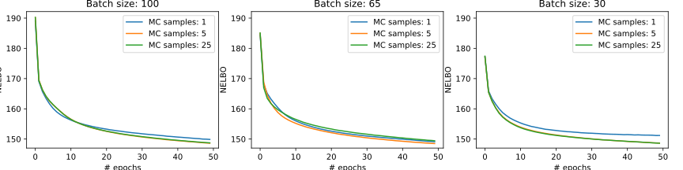

.. title: Inference in Variational Autoencoders with Different Monte Carlo Sample Sizes (Addendum)
.. slug: inference-in-variational-autoencoders-with-different-monte-carlo-sample-sizes-addendum
.. date: 2017-11-27 00:47:03 UTC+11:00
.. tags: bayesian, variational inference, keras, tensorflow, python, variational autoencoder, unsupervised learning, deep learning, representation learning, mathjax
.. category: coding
.. link: 
.. description: 
.. type: text

.. admonition:: Draft

   Please do not share or link.

This is a short addendum to a previous post that demonstrates how to perform
:doc:`inference-in-variational-autoencoders-with-different-monte-carlo-sample-sizes`
using the basic modular framework we developed in an :doc:`earlier post 
<implementing-variational-autoencoders-in-keras-beyond-the-quickstart-tutorial>`.

   The negative evidence lower bound (ELBO) plotted after each training epoch
   for various combinations of batch and Monte Carlo sample sizes.

Appendix
--------

Please find the accompanying Jupyter Notebook used to generate the diagrams 
and plots in this post `here </listings/vae/variational_autoencoder_mc_samples_grid.ipynb.html>`_.
