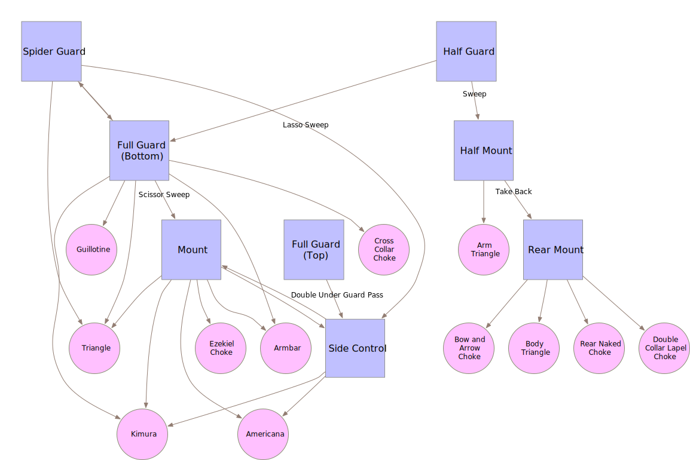

.. title: Cracking the Jiujitsu Puzzle
.. slug: cracking-the-jiujitsu-puzzle
.. date: 2017-03-31 22:59:02 UTC+11:00
.. tags: draft
.. category: 
.. link: 
.. description: 
.. type: text

* Rickson Gracie's Flow Charts
* Seeing a diagram before
* A useful, simple model (simplifying assumptions)
* Provides a point of reference, measurable progress
* Kind of like a personal semantic network
* Not accurate - zero-sum minimax game. But need not be accurate to be useful.

Test
